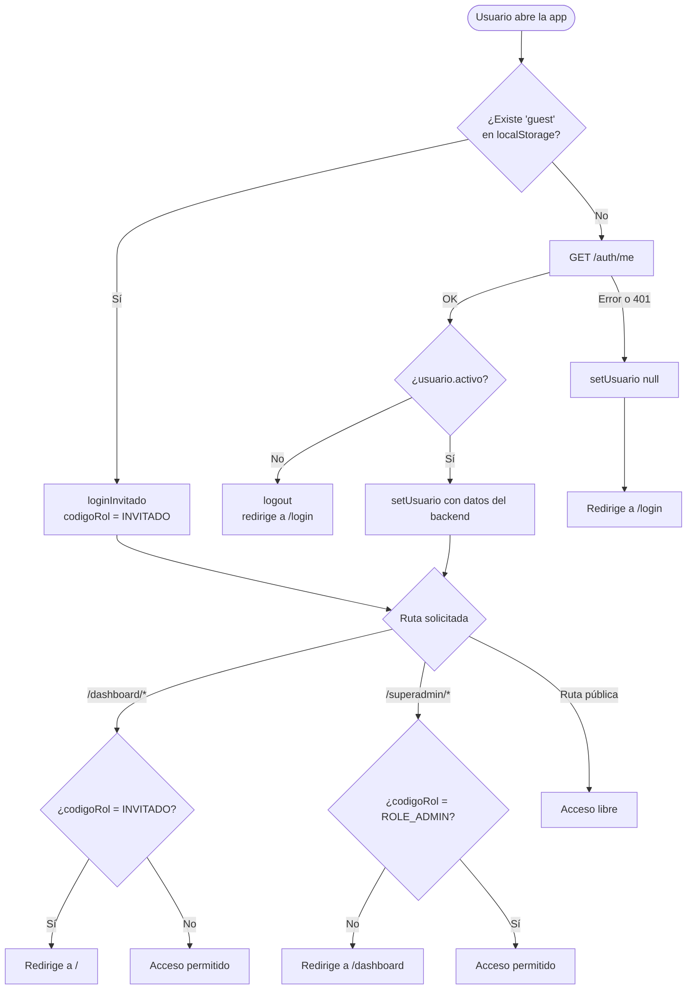

# Autenticación y roles

## Cómo funciona la sesión

La autenticación se basa en **JWT (JSON Web Token)**. El backend devuelve un token de acceso que el frontend almacena en `localStorage` bajo la clave `accessToken`. Además, el backend establece una **cookie HttpOnly** para mayor seguridad en entornos del mismo dominio.

Todas las peticiones al backend pasan por el wrapper `apiFetch` (definido en `lib/api.ts`), que inyecta automáticamente:
- La cookie de sesión mediante `credentials: "include"`.
- El token `Bearer` desde `localStorage`, necesario cuando el frontend (Vercel) y el backend (Render) están en dominios distintos y las cookies entre dominios no se envían.

---

## Diagrama de flujo de sesión



---

## AuthContext

El estado de sesión se gestiona en `context/AuthContext.tsx` mediante un **React Context** que envuelve toda la aplicación desde `app/layout.tsx`.

### Qué expone el contexto

```ts
interface AuthContextType {
  usuario: Usuario | null       // datos del usuario autenticado (o null si no hay sesión)
  setUsuario: (u: Usuario | null) => void
  logout: () => Promise<void>   // llama a POST /auth/logout y limpia el estado
  loginInvitado: () => void     // activa la sesión de invitado sin llamar al backend
}
```

### Tipo `Usuario`

```ts
interface Usuario {
  nombre: string
  apellidos?: string
  codigoRol: string           // ver tabla de roles más abajo
  nombreEmpresa?: string
  logoEmpresaUrl?: string
  activo?: boolean
  empresaId?: string
  usuarioId?: string
  email?: string
  avatarUrl?: string
  bannerUrl?: string
  nombreRol?: string
  invitado?: boolean          // true solo en modo invitado
}
```

### Ciclo de vida de la sesión

1. Al montar `AuthProvider`, se comprueba `localStorage` para detectar el modo invitado.
2. Si no hay invitado, se llama a `GET /auth/me` para restaurar la sesión.
3. Si el backend devuelve un usuario inactivo (`activo: false`), se ejecuta `logout()`.
4. En `logout()` se llaman a `DELETE /auth/logout`, se borra `accessToken` y `guest` de `localStorage` y se pone `usuario` a `null`.

---

## Tabla de roles

| `codigoRol` | Nombre | Acceso |
|---|---|---|
| `INVITADO` | Invitado | Solo la landing pública (`/`). No puede acceder al dashboard. |
| `ROLE_EMPLEADO` | Empleado | Dashboard: Inicio, Formación, Comunicación. |
| `ROLE_ADMIN_EMPRESA` | Administrador de empresa | Dashboard completo: incluye la sección Administración (gestión de módulos y empleados). |
| `ROLE_ADMIN` | Superadministrador | Área `/superadmin`: gestión global de empresas, solicitudes, estadísticas y comunicados. |

---

## Guards de layout

### Dashboard (`app/dashboard/layout.tsx`)

El layout del dashboard protege **todas** las rutas bajo `/dashboard`:

1. Si no hay usuario en el contexto, llama a `GET /auth/me` para comprobar si hay sesión activa.
2. Si no hay sesión válida → redirige a `/login`.
3. Si el usuario es `INVITADO` → redirige a `/` (la landing).
4. Mientras se verifica la sesión, muestra un spinner de carga.

### Superadmin (`components/auth/SuperAdminRoute.tsx`)

Componente de alto orden que envuelve el contenido de las páginas del superadmin:

- Si no hay usuario → redirige a `/login`.
- Si el `codigoRol` no es `ROLE_ADMIN` → redirige a `/dashboard`.
- Si pasa los dos checks → renderiza el contenido.

---

## Modo invitado

El modo invitado permite acceder a la landing pública sin necesidad de registrarse. Se activa llamando a `loginInvitado()` del contexto, que:

1. Crea un objeto `Usuario` local con `codigoRol: "INVITADO"` e `invitado: true`.
2. Guarda `"true"` en `localStorage` bajo la clave `guest`.

Este modo no hace ninguna llamada al backend. Al cerrar sesión se elimina la clave `guest` de `localStorage`.

